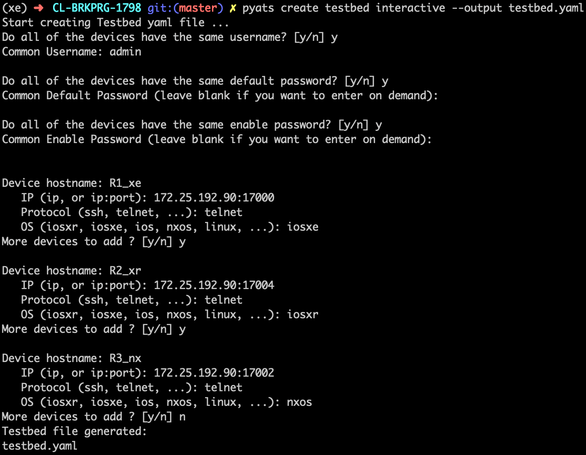
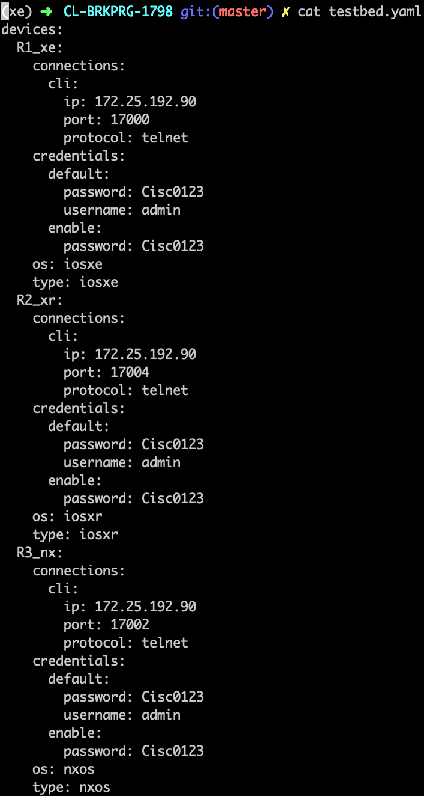

# Workshop Content

##### Background Settings

For this demo we are providing a VIRL file that can be used to run these demos
at your own pace.

It contains 1 XE, XR and NXOS device with <Takashi to fill>.

For full context - This is best to use with the CiscoLive 2020 US Video.


##### Agenda

1. Create a testbed file
2. Genie Cli
3. Python
4. Genie Blitz

##### Create a testbed file





##### Genie CLI

[Genie offers command line tools](https://pubhub.devnetcloud.com/media/genie-docs/docs/cli/index.html)
that allows the user to manage their network whilst leveraging the power of
Genie Python libraries, without any prerequisite understanding in Python or
automation.

The first step is to learn the good state of the devices.

```bash
# run pyATS CLI
pyats parse "show version" --testbed-file testbed.yaml --output snapshot
```

Take a moment to look at the output.

Your call to this pyATS CLI stores the device output and the parsed datastructure
into a folder called `snapshot`.

*Consider this as an operational state snapshot for the testbed you are in charge of.*

Here is the list of available [Parsers](https://pubhub.devnetcloud.com/media/genie-feature-browser/docs/#/parsers).

With an editor, you can open the two generated files:

* `learnt/ospf_nxos_nx-osv-1_parsed.txt`
* `learnt/ospf_nxos_nx-osv-1_console.txt`

The `_parsed` file contains the datastructure from the show commands.

The `_console` file contains the cli and device output of the command without
being parsed.

Much more information on our
[CL-DevNet-2595](https://github.com/CiscoTestAutomation/CL-DevNet-2595) which
goes into much detail of the cli commands.

##### Python

Presented in the video

#### Quick Testing

Presented in the video

